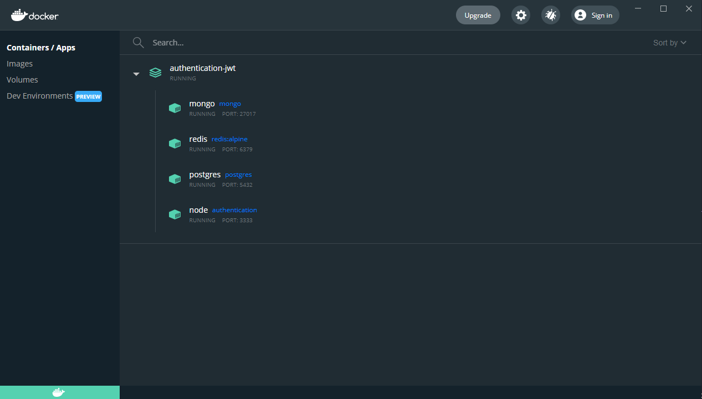

# Cadastro de usuários

Para rodar o projeto tem que ter o [Docker](https://www.docker.com/) instalado na sua maquina.

> Para subir os contêineres.

```bash
docker-compose up -d
```

> Para deletar os contêineres.

```bash
docker-compose down
```

- **Cadastro:** Ao se cadastra o usuário recebera um email notificando o sucesso.

- **Autenticação:** A autenticação foi feita com jwt.

- **Recuperar senha:** Token gerado pela aplicação, enviado em um link no email do usuário, esse link expira em 1h.

- **Buscar usuários:** Para isso a usuário deve estar autenticado na aplicação.

- **Atualizar perfil:** Para atualizar as informações do perfil o usuário deve estar autenticado.

- **Deletar perfil:** Para deletar perfil o usuário deve apenas estar autenticado.

- **Notificação com o mongodb:** Quando o usuário criar conta e trocar a senha, recebera uma notificação sobre.

---

# Cadastro.


# Recuperar senha.


# Token gerado para recuperar senha.


# Dependências.

bcryptjs, celebrate, cors, date-fns, dotenv, express, express-async-errors,
handlebars, jsonwebtoken, mongodb, multer, nodemailer, pg,

---

# Docker



# Build

```bash
yarn add -D babel-plugin-transform-typescript-metadata @babel/plugin-proposal-decorators @babel/plugin-proposal-class-properties
```

```bash
yarn add -D @babel/cli @babel/core @babel/node @babel/preset-env @babel/preset-typescript babel-plugin-module-resolver

```

```js
module.exports = {
  presets: [
    ['@babel/preset-env', { targets: { node: 'current' } }],
    '@babel/preset-typescript',
  ],
  plugins: [
    'babel-plugin-transform-typescript-metadata',
    ['@babel/plugin-proposal-decorators', { legacy: true }],
    ['@babel/plugin-proposal-class-properties', { loose: true }],
  ],
};
```
